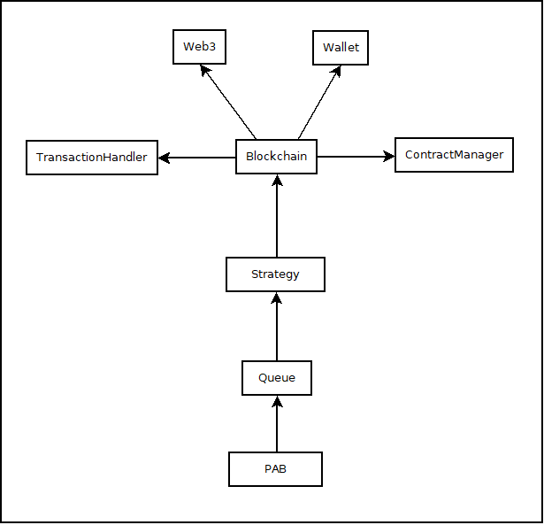

# Project structure

The project structure is as follows:

The `Blockchain` exposes the auth, transaction and contract interfaces, allowing strategies to interact with the
network and compound pools (or anything else).

You can inherit from `pab.strategy.BaseStrategy` to create your own strategies. 

See also: [GUIDE](GUIDE.md).

